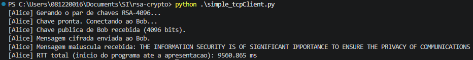
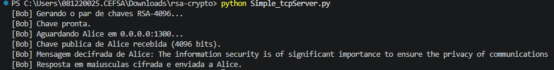
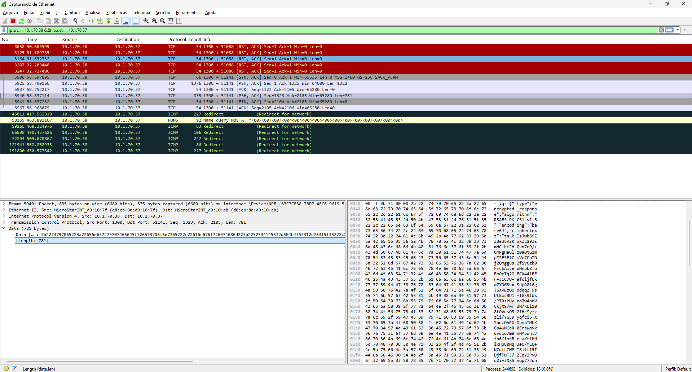

# RSA sobre TCP: Alice e Bob

Implementação didática do algoritmo RSA integrada aos exemplos
`Simple_tcpServer.py` e `simple_tcpClient.py`. O cliente representa **Alice**
e o servidor representa **Bob**.

As evidências da execução foram adicionadas à pasta `prints-rsa/`. Elas
registram a saída do cliente, a saída do servidor e um trecho da comunicação
observado no Wireshark.

## Objetivos da atividade

- Gerar um par de chaves RSA no cliente e outro par no servidor.
- Usar um módulo RSA com exatamente 4096 bits.
- Trocar as chaves públicas em texto puro pela conexão TCP.
- Cifrar a mensagem de Alice com a chave pública de Bob.
- Fazer Bob decifrar a mensagem, convertê-la para maiúsculas e cifrá-la novamente com a chave pública de Alice.
- Fazer Alice decifrar e apresentar a resposta.
- Medir o tempo desde o início do programa cliente até a apresentação da mensagem em maiúsculas.

## Arquivos

| Arquivo | Função |
| --- | --- |
| `Simple_tcpServer.py` | Bob: gera chaves, recebe a chave de Alice, decifra e responde. |
| `simple_tcpClient.py` | Alice: gera chaves, envia a chave pública, cifra a mensagem e calcula o RTT. |
| `rsa_4096.py` | Miller-Rabin, geração de primos, chaves RSA, cifragem e decifragem. |
| `tcp_protocol.py` | Delimitação de mensagens JSON em uma conexão TCP. |
| `prints-rsa/client.png` | Evidência da execução do cliente Alice. |
| `prints-rsa/server.png` | Evidência da execução do servidor Bob. |
| `prints-rsa/wireshark.png` | Evidência de um segmento TCP analisado no Wireshark. |

## Requisitos

- Python 3.8 ou superior.
- Nenhuma biblioteca externa: o projeto usa apenas a biblioteca padrão do Python.
- Duas máquinas na mesma rede para a demonstração completa ou `localhost` para um teste inicial.
- Porta TCP `1300` liberada no firewall da máquina de Bob.

## Como executar em duas máquinas

### 1. Bob inicia o servidor

Na máquina que atuará como servidor, execute:

```bash
python3 Simple_tcpServer.py
```

No Windows, o comando equivalente é:

```powershell
python Simple_tcpServer.py
```

O servidor escuta em todas as interfaces (`0.0.0.0`) na porta `1300`. A
geração das chaves de 4096 bits pode levar alguns segundos. Aguarde a
mensagem:

```text
[Bob] Aguardando Alice em 0.0.0.0:1300...
```

Descubra o endereço IP da máquina de Bob, por exemplo com `ip addr` no Linux
ou `ipconfig` no Windows.

### 2. Alice inicia o cliente

Na máquina de Alice, substitua o endereço abaixo pelo IP de Bob:

```bash
python3 simple_tcpClient.py 192.168.78.169
```

No Windows, o comando equivalente é:

```powershell
python .\simple_tcpClient.py 192.168.78.169
```

O endereço `192.168.78.169` é o valor padrão herdado do exemplo original.
Também é possível informar outra porta:

```bash
python3 simple_tcpClient.py 192.168.78.169 --port 1300
```

A mensagem padrão enviada é:

```text
The information security is of significant importance to ensure the privacy of communications
```

Para testar outra mensagem sem alterar o código:

```bash
python3 simple_tcpClient.py 192.168.78.169 --message "uma mensagem de teste"
```

O servidor atende uma única conexão por execução. Para uma nova demonstração,
execute o servidor novamente.

## Protocolo de comunicação

As mensagens de aplicação são objetos JSON terminados por `\n`. Essa
delimitação é necessária porque TCP é um fluxo de bytes e não preserva
fronteiras de mensagens.

1. Alice abre a conexão TCP com Bob.
2. Alice envia sua chave pública em texto puro:

```json
{"type":"public_key","role":"Alice","algorithm":"RSA-4096","bits":4096,"n":"...","e":"65537"}
```

3. Bob envia sua chave pública em texto puro no mesmo formato, com `role` igual a `Bob`.
4. Alice cifra a mensagem com `(n_Bob, e_Bob)` e envia um JSON com o resultado em Base64. O conteúdo da mensagem não aparece em texto puro no payload:

```json
{"type":"encrypted_message","algorithm":"RSAES-PKCS1-v1_5","encoding":"base64","ciphertext":"..."}
```

5. Bob usa sua chave privada para decifrar, converte o texto para maiúsculas e cifra a resposta com a chave pública de Alice.
6. Bob envia a resposta como `encrypted_response`.
7. Alice decifra a resposta, apresenta o texto em maiúsculas e imprime o RTT.

Os campos `n` e `e` são convertidos para texto decimal no JSON para que a
chave pública fique facilmente identificável durante a análise do fluxo. O
texto cifrado é transportado em Base64; Base64 não é cifragem.

## Implementação do RSA

Para uma chave RSA de 4096 bits, o programa faz o seguinte:

1. Gera dois primos prováveis `p` e `q`, cada um com 2048 bits.
2. Calcula `n = p * q` e repete a geração se `n` não tiver exatamente 4096 bits.
3. Calcula `phi(n) = (p - 1) * (q - 1)`.
4. Usa `e = 65537` como expoente público.
5. Calcula `d`, o inverso modular de `e` módulo `phi(n)`.
6. Publica `(n, e)` e mantém `(n, d)` localmente.

A cifragem e a decifragem usam exponenciação modular:

```text
c = m^e mod n
m = c^d mod n
```

Antes da exponenciação, a mensagem recebe preenchimento `RSAES-PKCS1-v1_5`
com bytes aleatórios. Isso permite transportar bytes de texto e evita que a
mesma mensagem produza sempre o mesmo bloco cifrado. Para uso real, uma
biblioteca criptográfica auditada e RSA-OAEP seriam preferíveis; este projeto
é voltado ao entendimento da atividade.

### Uso dos códigos fornecidos

- A função `is_probable_prime` reutiliza a estrutura do `primo_hyper.py`: pré-checagem por pequenos primos, decomposição de `n - 1` e teste Miller-Rabin.
- Para números menores que `2**64`, são mantidas as bases determinísticas fornecidas. Para candidatos de 2048 bits, são usadas 12 bases aleatórias.
- `random_odd_candidate` implementa a ideia do `gen_4096.py`, ligando o bit mais alto. Também liga o bit mais baixo para evitar candidatos pares.
- A fonte de aleatoriedade foi trocada de `random` para `secrets`, pois os valores são usados na geração de chaves. O tamanho de 4096 bits se refere ao módulo `n`; gerar `p` e `q` com 4096 bits produziria uma chave de aproximadamente 8192 bits.

## RTT

O cronômetro usa `time.perf_counter()` no cliente. A primeira medição é feita
no início de `main`, antes da geração das chaves e da conexão TCP. A segunda é
feita imediatamente depois do `print` que apresenta a mensagem maiúscula
recebida.

Assim, o valor exibido é deliberadamente o tempo total da atividade:

```text
geração da chave de Alice
+ conexão TCP
+ troca das chaves públicas
+ cifragem e envio
+ processamento de Bob
+ resposta, decifragem e apresentação
```

Ele não representa somente o atraso da rede. Essa definição segue a
orientação da atividade sobre os pontos inicial e final da contagem.

## Evidências da execução

As imagens abaixo foram fornecidas para a entrega e mostram uma execução
completa do protocolo.

### Alice, cliente



A saída de Alice registra a geração da chave, o recebimento da chave pública
de Bob com 4096 bits, o envio da mensagem cifrada, a mensagem devolvida em
maiúsculas e o RTT medido (`9560.865 ms` nessa execução).

### Bob, servidor



A saída de Bob registra a geração da chave, o recebimento da chave pública de
Alice com 4096 bits, a mensagem decifrada e o envio da resposta cifrada.

### Fluxo TCP no Wireshark



Na captura fornecida, o filtro exibido foi:

```text
ip.src == 10.1.70.38 && ip.dst == 10.1.70.37
```

O quadro TCP selecionado é o pacote `5940`, com origem `10.1.70.38:1300`,
destino `10.1.70.37:51141` e 781 bytes de dados. No painel hexadecimal e
ASCII aparece um objeto JSON que começa com `"type":"encrypted_response"` e
contém o campo `ciphertext` em Base64. Esse trecho evidencia que a resposta
foi transportada pelo TCP como texto cifrado, e não como a mensagem em claro.

Para visualizar a ordem de todas as etapas em uma nova captura, use o filtro
mais geral e siga o fluxo TCP:

```text
tcp.port == 1300
```

Depois, clique com o botão direito em um pacote da conexão e selecione
**Follow > TCP Stream**. Nesse fluxo devem aparecer as duas mensagens
`public_key` em texto puro, seguidas por `encrypted_message` e
`encrypted_response`.

O fato de a chave pública trafegar em texto puro é intencional nesta
atividade. Sem autenticação ou assinatura digital, um atacante poderia
substituir chaves públicas; portanto, este protocolo não deve ser usado como
substituto de TLS em sistemas reais.

## Teste local rápido

Para validar a implementação antes do teste entre máquinas, abra dois
terminais na pasta do projeto. No primeiro:

```bash
python3 Simple_tcpServer.py
```

No segundo:

```bash
python3 simple_tcpClient.py 127.0.0.1
```

O cliente deve mostrar a mensagem em maiúsculas e uma linha com o RTT total.

## Entrega

Repositório: <https://github.com/Trevejo/rsa-crypto>
